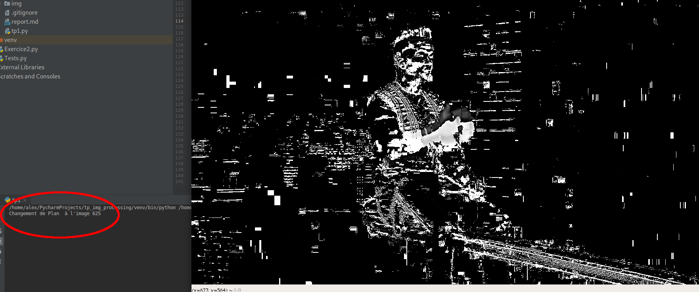

# TP Traitement D'images

#### Ben Crulis & Alexandre Chanson

Note envoyer à donatello.conte@univ-tours.fr avant le 10/02/19

## Exercice 1 : Prise en main de Python + OpenCV

Le code *main* en Python va principalement ressembler à ceci:

```python
# Mon script OpenCV : Video_processing
# importation des librairies, opencv et numpy
import numpy as np
import cv2
#
def frame_processing(imgc):
return imgc
# Charge la video depuis le disque, ou la webcam avec 0 comme parametre
cap = cv2.VideoCapture('data/jimmy_fallon.mp4')
#Tant que la video n'est pas fini ou que l'user apuis sur la touche q
while (not (cv2.waitKey(40) & 0xFF == ord('q'))):
    # On lit une frame de la video
    ret, frame = cap.read()
    # si la frame existe
    if ret:
        # On copie la frame puis on passe la copie en greyscale
        img = frame.copy()
        gray = cv2.cvtColor(img, cv2.COLOR_BGR2GRAY)
        #On applique une transformation a l'image
        gray = frame_processing(gray)
        #On affiche dans deux fenetres separées la video avant/apres transformation
        cv2.imshow('MavideoAvant', frame)
        cv2.imshow('MavideoApres', gray)
    else:
        print('video ended')
        break

# When everything done, release the capture
cap.release()
cv2.destroyAllWindows()
```

## Exercice 2 : Filtrage, convolutions, détection de contours

### Question 1

```python
def blur(intensity):
    def intern(img):
        kernel = np.ones((intensity,intensity),np.float32)/(intensity**2)
        return cv2.filter2D(img,-1,kernel)
    return intern

processing_f = blur(20)
```

Pour la question 1 nous utilisons un noyau de convolution pour appliquer un flou basique à l'image. Ce flou est une approximation d'un flou gaussien et produit des artéfacts quand la valeur du flou est grande.

Puis un flou gaussien (le parametre doit etre un nombre impair), ce flou est couteux en terme de puissance de calcul mais produit un résultat sans artéfacts:

```python
def gaussian_blur(intensity):
    def intern(img):
        return cv2.GaussianBlur(img,(intensity,intensity),0)
    return intern

processing_f = gaussian_blur(101)
```


Ou peux aussi effectuer un flou median:

```python
def median_blur(intensity):
    def intern(img):
        return cv2.medianBlur(img,intensity)
    return intern

processing_f = median_blur(21)
```


### Question 2

On explore d'abbord l'algorithm de sobel qui detecte les bords soit en vertical soit en horizontal.

```python
def sobel(size,x,y):
    def intern(img):
        return cv2.Sobel(img,cv2.CV_64F,x,y,ksize=size)
    return intern

sobelx = sobel(3,1,0)
sobely = sobel(15,0,1)

processing_f = compose(sobely, greyscale)
```


On voit qu'il y a très peux de detection sur les rideaux en arrière plan ouisque ils ont des contours verticaux, il semble egalement que l'algorithme trouve des contours parfetement droit on supose que se sont des artefacts de l'algorithme de compression utilisé par youtube.

On veux ensuite utiliser un autre algorithme (canny), on choisie de le reproduire en utilisant les kernel de convolution et d'autre fonctions basiques d'opencv plutot que d'utiliser la fonction toute faite Canny.

## Exercice 2 bis : Images binaires et opérations entre images

### Question 1

En appliquant un seuil sur la valeur d'un pixel de l'image, on passe d'une image ou chaque pixel peut avoir beaucoup de valeurs différentes à une image ou chaque pixel porte une valeur pouvant être codée sur 1 bit. La valeur 1 représente un bit au dessus du seuil alors que 0 représente une valeur en dessous. Cela fait de l'image une image binaire pouvant servir de masque à d'autres transformations.

Deux types de seuillages existent, le seuillage fixe applique le même seuil pour chaque pixel alors qu'un seuil adaptatif dépend d'autres conditions, par exemple la valeur ou la position du pixel.

Le code correspondant à un seuillage fixe de 75 pour une binarisation ressemble à ceci:

```python
def seuil(img):
    discard, result = cv2.threshold(img, 75, 255, cv2.THRESH_BINARY)
    return result
```

Le **255** est la valeur à laquelle doit être mis un pixel qui à une valeur au dessus du seuil.

Le traitement suivant donne le résultat suivant:


Un seuil peut servir à mettre en évidence les parties brillantes d'une image et rendre plus facile la reconaissance de forme par la suite.

Le code suivant sert à effectuer un seuil adaptatif:

```python
def seuil_gaussien(img):
    return cv2.adaptiveThreshold(img, 255, cv2.ADAPTIVE_THRESH_GAUSSIAN_C, cv2.THRESH_BINARY, 21, 2)
```

L'application de ce seuil produit le résultat suivant:


L'avantage de ce seuillage adaptatif est qu'il permet d'être plus efficace qu'un seuil fixe dans les cas ou l'éclairage n'est pas constant.

### Question 2

Appliquer une soustraction à deux images successives permet de mettre en évidence les parties de l'images qui ont changées d'une frame à l'autre, mettant en évidence les mouvements. D'autres traitements nécessitants de connaitre le mouvement à l'oeuvre dans l'image peuvent ensuite êtres appliqués à cette image.

On modifie le code du *main* de la façon suivante:

```python
prev = None
while True:
    ret, frame = cap.read()
    if ret:
        img = frame.copy()
        img = greyscale(img)

        res = img
        if prev is not None:
            res = img - greyscale(prev)

        cv2.imshow("before", frame)
        cv2.imshow("after", res)

        prev = frame
    else:
        print('video ended')
        break
```

Ceci permet de conserver en mémoire la frame précédente (prev) afin de pouvoir faire la différence entre avec l'image actuelle (img):

```python
res = img - greyscale(prev)
```


## Exercice 3 : Détection de changements de plan et résumé automatique de vidéo

### Question 1

On modifie à nouveau le *main* pour détecter si un grand nombre de pixels change d'une image à l'autre. Si un gros changement se produit, cela est très certainement dû à un changement de plan dans la vidéo. On compte aussi les images afin de pouvoir afficher le numéro de l'image ou se produit le changement de plan.

```python
i = 0
prev = None
while True:
    i += 1
    ret, frame = cap.read()
    max_change = frame.shape[0]*frame.shape[1]
    epsilon = 0.1
    max_change = (1-epsilon)*max_change*127
    if ret:
        img = frame.copy()
        img = greyscale(img)

        res = img
        if prev is not None:
            res = img - greyscale(prev)
            if np.sum(res) > max_change:
                print("Changement de Plan  à l'image {}".format(i))

        cv2.imshow("before", frame)
        cv2.imshow("after", res)

        prev = frame
    else:
        print('video ended')
        break
    if cv2.waitKey(40) & 0xFF == ord('q'):
        break
```



### Question 2

## Exercice 4 : Calcul de descripteurs SIFT, appariemment de descripteurs et résumé automatique de vidéo

L'algorithme SIFT permet la construction d'une mesure de similarité entre images en comparant le ratio de points SIFT représentatifs d'une image et le nombre de points total.

### Question 1

Pour trouver les changements de plans, il faut réussir à déterminer à quel point une image diffère de celle qui la suit dans la vidéo. Une grande différence à de fortes chances de correspondre à un changement de plan ou "cut". Il suffit ensuite de repérer ces changements qui dépassent un seuil et stocker les images dans différentes séquences correspondant aux plans.


Malheureusement, cette technique présente de nombreux défauts. Le plus important est qu'elle n'est pas robuste a certains types de vidéos ou le décor ou les objets filmés bougent très vite sans pour autant être un changement de plan. Il faudrait pouvoir déterminer le sens du contenu filmé afin de pouvoir déterminer de manière plus précise si parler de changement de plan est censé. Une méthode qui serait ainsi certainement beaucoup plus efficace serait d'entrainer un réseau de neurone auto-encodeur sur des millier de vidéos afin qu'il en apprenne une sémantique. La sémantique des vidéos pourraient être ainsi codées sous forme de vecteurs de moindre dimensions. La technique de la différence entre deux vecteurs successifs suivi d'un cut pourrait être utilisée à nouveau pour détecter des changements significatif correspondant à un changement de plan.

### Question 2

Afin de trouver les différents plans de manière plus précise, on calcule les points SIFT d'une image et de la suivante. Nous pouvons ensuite déterminer à quel point l'image est différente et déterminer, à l'aide d'un seuil, si il y a eu un changement de plan.

Le code de la fonction qui calcule la similarité entre deux images en utilisant les points SIFT est le suivant:

```python
def similarity_sift(img1, img2):
    kp1, des1 = sift.detectAndCompute(img1, None)
    kp2, des2 = sift.detectAndCompute(img2, None)

    matches = bf.knnMatch(des1, des2, k=2)

    good = []
    for m, n in matches:
        if m.distance < 0.75 * n.distance:
            good.append([m])
    return len(good) / float(len(kp2))
```

La fonction calcule les points SIFT des deux images, utilise un algorithme de clustering appelé KNN pour faire correspondre les différents points. Ensuite on garde les points suffisemment proches grâce à un seuil et on calcule le ratio du nombre de points suffisemment proches sur le nombre de points total ce qui nous donne une valeur de similarité entre 0 et 1.

### Question 3

On créé une fonction qui, donné une liste d'images avec leur indexes, renvoie l'image qui à la plus forte similarité avec la suivante. Voici son code source:

```python
def representant_naif(images: list):
    
    best = img[0]
    best_score = 0.0
    
    for img1,img2 in zip(images, images[1:]):
        
        sc = similarity_sift(img1[0], img2[0])
        
        if sc > best_score:
            best = img1
            best_score = sc
    
    return (best[0], best[1], best_score) # (image, index, score)
```

Cette fonction naïve possède le gros défaut de ne pas trouver une image représentative de tout le plan mais seulement un moment dans le plan ou il n'y a pas eu de grande différence entre les images. Ceci risque de toujours trouver le moment ou le plan est le plus statique, qui n'est pas forcément l'image recherchée dans notre cas.

### Question 4

Afin de trouver l'image qui est la plus représentative du plan, qui est une séquence d'image, il faut calculer une similarité pour toutes les paires d'images possibles et prendre l'image qui est en moyenne la lus similaire à toutes les autres. Ceci est une méthode employée dans certains algorithmes de clustering et revient à trouver le médoïde d'un ensemble d'objets. Le calcul de similarité des images sera basé sur la proximité des points SIFT qui sont les points significatif d'une image. On utilise une heuristique pour trouver un médoïde approché pour chaque plan afin d'éviter l'explosition combinatoire du calcul exhaustif.

On utilise donc l'heuristique suivante:

```python
def representant_random_search(images: list, n_iter: int, sampling_fraction: float):
    
    best = rd.choice(images)
    best_score = 0.0
    
    for i in range(n_iter):
        elected = rd.choice(images)
                
        scores = [similarity_sift(img[0], elected[0]) for img in
            rd.choices(images, k=int(sampling_fraction*len(images)))]
        
        sc = sum(scores)/len(scores)
        
        if sc > best_score:
            best_score = sc
            best = elected
    
    return (best[0], best[1], best_score) # (image, index, score)
```

Cette fonction prend une liste d'image avec leurs indexes en entrée, un nombre de représentants possibles à tirer au hasard (n_iter) et enfin un nombre réel entre 0 et 1 qui correspond à la fraction de la taille de la liste qu'il faut échantilloner à chaque itération. La fonction tire chaque image au hasard dans la liste puis un échantillon aléatoire. Ensuite on calcule la moyenne des similarités du représentant possible avec les images de l'échantillon. Si la similarité est meilleure que la meilleure image rencontrée jusqu'alors, alors elle la remplace. On renvoie ensuite la meilleure image, son indexe et son score.


